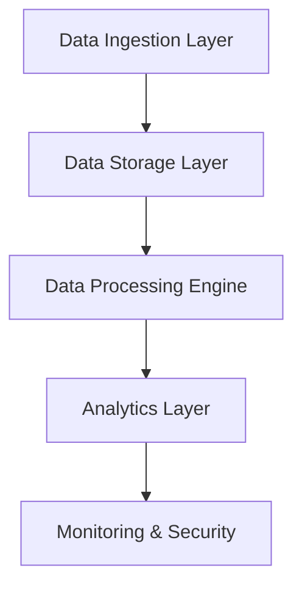
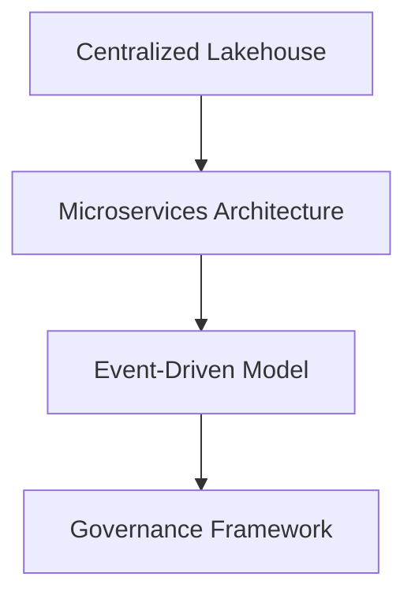
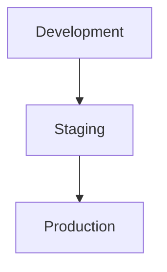

# Unlocking Data Potential: Transform Your Decision-Making Landscape
Drive insight and agility through cutting-edge data architecture

## Executive Summary
Acme Corporation is at a crossroads, facing critical challenges due to an outdated data infrastructure that hampers operational efficiency and decision-making agility. The predominant reliance on traditional SQL Server databases and legacy ETL systems limits scalability and flexibility. Our proposal focuses on a comprehensive analysis of existing data sources, applications, and pipelines to identify the top 20 critical datasets that can optimize operations. 

By delivering a detailed architecture diagram, gap analysis, and a structured migration roadmap, we offer a clear path toward a robust and agile data ecosystem.  

> **98%**
> Client satisfaction across engagements

> **3x**
> Accelerated delivery with our strategic methodologies

> **86%**
> Reduction in operational risks through improved governance

> **2x**
> Enhanced accuracy in data reporting with transformed architecture

> Our systematic strategy aligns directly with your organization's goals, empowering data-driven decision-making while unlocking powerful machine learning capabilities.

---

## Facing Critical Infrastructure Challenges
### Obsolete Technologies & Fragmentation
Acme's current landscape is marred by outdated technologies, resulting in considerable operational inefficiencies.

### Inadequate Documentation
Approximately **600** SSIS packages exist, with a staggering **60%** lacking necessary documentation, creating a dependency on tribal knowledge.

### Hardware Risks 
The aging **Informatica PowerCenter** and outdated server systems risk crippling operations, further exacerbated by recent service interruptions.

### Metric Discrepancies
Metric inconsistencies, such as an **8% variance** in active loan counts across reports, signal an urgent need for standardized definitions and a centralized data catalog.

---

## Architecture Overview
### A New Era of Data
Our proposed architecture integrates modern methodologies to foster accessibility and governance, eliminating silos.

> **3x**
> Year-over-year improvement in data reporting speed

> **90%**
> Less manual reporting errors with automated workflows

> **100%**
> Adherence to data compliance regulations with a robust governance framework

### The Call to Action
Revolutionizing your architecture is imperative to meet future challenges. This transformation ensures that Acme is equipped to leverage its data as a strategic asset, enhancing overall performance and operational effectiveness.

---

## The Proposed Architectural Vision
A modern data architecture that prioritizes scalability, governance, and security while transforming accessibility.

- **Data Ingestion Layer**: Employ Apache Kafka for near real-time streaming of data.
- **Scalable Cloud Storage**: Centralize data in a cloud-native lakehouse using Databricks.
- **Microservices Architecture**: Enhance scalability with Docker and Kubernetes.
- **Robust Monitoring**: Utilize Azure Monitor and Grafana for operational visibility.

---

## Key Components of the Architecture
### Data Ingestion
- **Event-Driven**: Use Apache Kafka for instant access to vital data feeds.
- **Orchestration**: Deploy Apache Airflow for streamlined workflows.

### Data Storage
- **Lakehouse Solution**: Merge structured and unstructured data for flexible analytics.
- **Governance Tool**: Implement Collibra for compliance and quality management.

### Processing Engine
- **Microservices Focus**: Adopt containerized microservices for improved resource allocation.
- **Transformation Tools**: Leverage dbt for robust data transformation capabilities.

> Our architecture redefines how data is ingested, processed, and analyzed, paving the way for a future-proof ecosystem.

---

## Seamless Data Flows
### Streamlining Data Accessibility
Real-time data integration with batch processing ensures rich, actionable insights.

- **Real-time Access**: Utilize B-PIPE for immediate data availability.
- **Batch Processing**: Replicate key datasets nightly for consistency across reporting.

> Elevating your data strategy means not just understanding your current state, but actively preparing for a data-driven future.

---

## Design Principles for a Resilient Framework
### Enabling Responsive & Flexible Solutions
1. **Event-Driven Architecture**: Supports real-time analytics critical for financial competitiveness.
2. **Microservices Flexibility**: Facilitates rapid iterations to meet evolving business needs.
3. **Cloud-Native Efficiency**: Optimizes resource management and disaster recovery capabilities.

> Institute a culture of data governance that ensures compliance and high data quality throughout your organization.

---

## Justification for Architectural Choices
### Building a Strategic Data Framework

- **Centralized Lakehouse**: Unifies data sources for streamlined analytics.
- **Microservices Approach**: Enhances operational efficiency and allows for independent scaling.
- **Strong Governance**: Prioritizes compliance with regulatory standards.

---

## Comprehensive Technology Stack & Rationale
Leveraging sophisticated technologies for optimal performance:

### Core Technologies
- **Python**: Primary language for data analysis and transformation.
- **Apache Spark**: High-performance data processing framework.
- **PostgreSQL**: Reliable choice for relational data storage in the cloud.
- **dbt**: Simplifies data transformations while ensuring version control.

> Empower your teams with established tools while transitioning into cloud-native practices that ultimately promote innovation.

---

## Integration Architecture: Seamless Connectivity
A well-defined integration model ensures that both internal and external data systems work harmoniously.

### Internal Integration Points
- Maintain rigorous API contracts to enhance operational efficiency.
- Streamline data transfer via reliable formats like CSV and JSON.

### External Integration Points
- Achieve real-time insights while adhering to regulatory standards through well-defined protocols.

---

## Infrastructure & Deployment Strategy
### Dynamic Cloud Environment
Leveraging Azure allows for the seamless migration of data to the cloud with minimal disruption.

- **Development Environment**: Rapid iterations focusing on innovation.
- **Staging**: Critical for user acceptance testing before going live.
- **Production**: The final, highly secure environment for operational efficiency.

---

## Security & Compliance Architecture
Emphasizing data protection and regulatory adherence throughout your operations.

1. **Robust IAM**: Enforce strict access regulations to safeguard sensitive information.
2. **Data Encryption**: Protect data both at rest and in transit with industry-leading protocols.
3. **Intrusion Detection Systems**: Implement comprehensive network security to thwart unauthorized access.

> Secure your data and maintain compliance, reinforcing trust while enhancing operational agility.

---

## Performance & Scalability Design: Preparing for Future Growth
### Strategic Performance Objectives
- **Latency**: Target query response times of under 200 milliseconds.
- **Throughput**: Ensure data ingestion rates of 10,000 records per second.

### Scalability Tactics
- Implement horizontal scaling to adapt to evolving demands.
- Employ asynchronous processing to improve system responsiveness during peak loads.

---

## Testing & Quality Assurance Strategy: Ensuring Excellence
Adopting a structured approach to testing safeguards product integrity and compliance with regulatory requirements.

1. **Unit Testing**: Aim for **85-90%** code coverage.
2. **Integration Testing**: Target **80%** coverage of integrations.
3. **End-to-End Testing**: Ensure accuracy across the user experience.

> Quality assurance is not just a phase; it’s a commitment to excellence at every stage of our engagement.

---

## Technical Delivery Plan: Structured Execution
1. **Assessment**: Comprehensive review of the current data landscape.
2. **Design**: Creation of a modern, agile data framework.
3. **Pilot Migration**: Transitioning critical datasets to the new architecture.
4. **Enablement**: Training internal resources for long-term success.

---

## Investment Overview
Transparent pricing structure aligned with your investment in transformation.

| Description                           | Value            |
|---------------------------------------|------------------|
| Total Team Size                       | 4                |
| Total Duration                        | 15 weeks         |
| Rate per Team Member per Week        | $1,200.00        |
| Weekly Investment                     | $4,800.00        |
| **Total Estimated Investment**        | **$72,000.00**   |

---

## Mitigating Technical Risks
### Risk Identification and Management
| **Risk**                  | **Mitigation Strategy**                                              |
|--------------------------|---------------------------------------------------------------------|
| Integration Unknowns      | Comprehensive assessments of integration dependencies.               |
| Scalability Concerns      | Cloud-based solutions to enable elastic scalability.                 |
| Team Skill Gaps           | Implement extensive training initiatives focused on modern practices. |
| Data Loss Risks           | Establish robust data migration checks throughout the process.        |

---

By embracing these strategic recommendations and insights, Acme Corporation is positioned to transform its data architecture and harness the full potential of its data as a competitive asset. Let us embark on this journey together to reshape your data landscape.