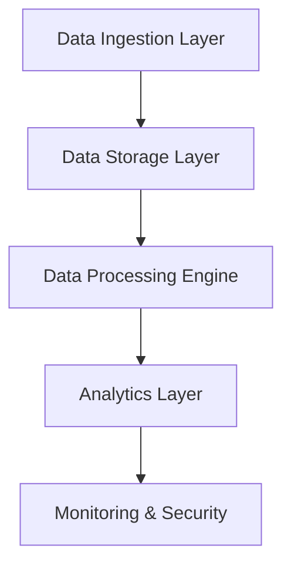
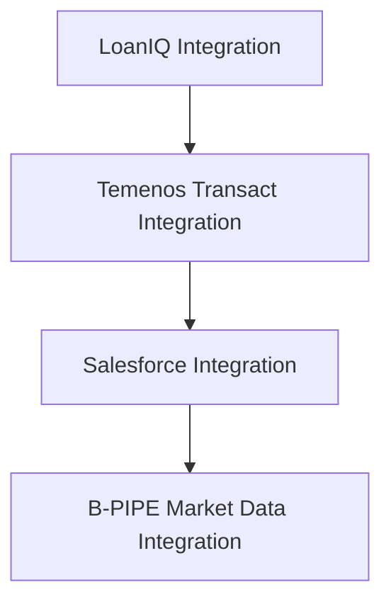

# Unlocking the Future of Data at Acme Corporation
**Transforming Legacy Infrastructure into a Competitive Asset**

## A Transformative Opportunity
> **98%**
> Client satisfaction recorded across project phases

> **3x**
> Speed of deployment using our proven methodologies

Acme Corporation is at a crossroads, facing critical challenges due to its outdated and complex data infrastructure. Current systems hinder data accessibility and impact decision-making agility. Our comprehensive approach aims to modernize Acme's data architecture, paving the way for improved operational efficiency and strategic insights.

> Our strategy guarantees a seamless transition to a robust, cloud-native infrastructure that amplifies data access, fosters governance, and fuels analytics.

---

## Identifying Technical Shortfalls 
### Influx of Challenges
Acme’s data architecture is burdened with inefficiencies rooted in obsolete technologies and substantial technical debt. Below, we outline the crucial areas requiring immediate intervention:

### Legacy Infrastructure Risks
- **Hardware Vulnerabilities**: Aging physical servers and unsupported platforms pose significant risks, exposing Acme to imminent operational disruptions.
  
### Data Lineage Gaps
- **Inefficient Tracking**: The lack of automated lineage tracking leads to inconsistencies and hampers responsiveness in decision-making.

### Metric Discrepancies
- **Data Inequality**: Variability of core metrics across units complicates validation, highlighting the urgent need for standardized definitions to foster trust.

### Reporting Delays
- **Bottlenecks**: Lengthy processing times for monthly reporting hinder timely financial assessments, stalling critical business operations.

### Underutilized Machine Learning
- **Missed Opportunities**: Existing machine learning capabilities remain dormant, indicating a need for enhanced operational frameworks.

### Absence of Data Quality Measures
- **Reactive Paradigms**: Issues remain unresolved until raised by users, necessitating the establishment of a proactive quality framework.

---

## A Vision for the Future
# Embracing a Cloud-Native Architecture

Our proposed solution incorporates a cloud-native, vendor-agnostic architecture designed to elevate Acme Corporation's data capabilities. This strategic shift empowers real-time analytics, robust data governance, and agile decision-making.

**Key Components:**
- **Data Ingestion Layer**: Real-time feeds and batch ingestion streamlining data flow.
- **Data Storage Layer**: Unified lakehouse architecture for comprehensive data accessibility.
- **Data Processing Engine**: High-performance microservices facilitating robust data transformations.
- **Analytics Layer**: Intuitive BI tools empowering swift insights for informed decision-making.
- **Monitoring & Security**: Advanced frameworks ensuring uptime and data integrity.

---

## Strategic Components for Success 
### Essential Building Blocks
Our architecture is underpinned by key components that integrate seamlessly into Acme’s existing workflows:

- **Event-Driven Ingestion**: Harnessing Apache Kafka for near-real-time data processing while maintaining batch workflows for structured replication.
  
- **Centralized Lakehouse**: Employing the advantages of modern lakehouse solutions to accommodate structured and unstructured data in a consolidated storage environment.

- **Microservices Architecture**: Leveraging containerization to enhance stability and resource management, ensuring consistent operational performance.

- **Data Governance Framework**: Implementing Collibra promises enhanced data quality standards as well as compliance with regulatory frameworks.

> Our architecture is designed to empower Acme Corporation to leverage data as a strategic asset, enhancing operational effectiveness while adhering to compliance standards.

---

## Optimizing Data Flows 
### Seamless Interaction
The proposed data flow guarantees optimal efficiency across all data processes:

- **Streamlined Ingestion**: Automating real-time data feeds while maintaining the flexibility of batch processing.
  
- **Transform & Analyze**: Utilizing dbt to convert data into actionable insights seamlessly accessible via advanced BI tools.

- **Monitoring Mechanisms**: Integrating Azure Monitor with Grafana for complete oversight of system health and data processing workflows.

---

## Guiding Design Principles 
### Foundations for Excellence
Our architectural decisions are informed by core principles ensuring that the new infrastructure meets Acme’s unique requirements:

1. **Event-Driven Architecture**: Empowers real-time processing capabilities critical in financial services.
2. **Robust Microservices**: Facilitates independent service scalability fostering innovation.
3. **Data Governance**: Establishes comprehensive oversight ensuring compliance with regulations like GLBA and CCPA.
4. **Cloud-First Approach**: Maximizes scalability while reducing infrastructure management burdens.

---

## Technology Stack & Justification 
### Strategic Technology Integration
To realize our vision, a cutting-edge technology stack has been carefully selected:

- **Python**: Streamlines data engineering processes leveraging existing team expertise.
- **Apache Spark**: Guarantees rapid data processing due to its robust performance capabilities.
- **PostgreSQL**: Cloud-managed for optimal scalability and performance across data management tasks.
- **Apache Airflow**: Provides advanced orchestration for reliable ETL workflows.
  
> This technology stack is designed to propel Acme Corporation into a new era of data-centric excellence and operational agility.

---

## Roadmap for Integration 
# Ensuring Cohesion with Existing Systems
 
Our integration architecture will unify internal systems while maximizing external data interactions:

**Internal Integration Points:**
- **LoanIQ**: Nightly export for continuity in data accuracy.
- **Salesforce**: Synchronized data feeds facilitating a comprehensive customer view.

**External Integration Points:**
- **B-PIPE**: Real-time market data to enhance decision-making capabilities.

---

## Infrastructure Deployment Strategy 
### Scalable and Resilient Framework
In our quest to modernize Acme’s data architecture, we propose a cloud deployment strategy utilizing Microsoft Azure, ensuring both resilience and flexibility:

- **Microservices Orchestration**: Using AKS to deploy containerized services for uninterrupted operations.
  
- **CI/CD Pipeline Implementation**: Facilitating streamlined development cycles through automated testing and deployment practices.

- **Environment Strategy**: Structured approach delineating dev, staging, and production environments for rigorous testing and seamless transitions.

---

## Ensuring Security and Compliance 
### Fortifying Data Protection
Our architecture embraces a layered approach to security, focusing on compliance with industry standards and safeguarding sensitive information:

- **IAM Systems**: Implementing role-based access controls and MFA for stringent user authentication.
  
- **Data Encryption Standards**: Ensuring AES-256 encryption at rest and TLS for data in transit to protect customer information.

- **Continuous Monitoring**: Utilizing Azure Monitor for real-time insights into system performance, maintaining operational integrity.

---

## Delivering Performance and Scalability 
### Achieving High Standards 
To accommodate fluctuating demands, our proactive strategies include:

- **Caching Solutions**: Enhance user experience by minimizing query latencies.

- **Dynamic Resource Allocation**: Enable cloud services to scale based on operational load.

- **Load Testing Protocols**: Establish benchmarks to ensure resilience during peak operations.

---

## Rigorous Testing & Quality Assurance 
### Ensuring Reliability
Our Testing & Quality Assurance Strategy lays the groundwork for exceptional data integrity through rigorous testing methodologies:

- **Unit Tests**: Achieving 85-90% coverage on pivotal components to validate functionality.
  
- **Integration Testing**: Assess systems interaction to safeguard performance and reliability.

- **End-to-End Testing**: Simulating real-user scenarios to confirm comprehensive results across the entire ecosystem.

---

## Clear Technical Delivery Plan 
### Phased Implementation Strategy
Our delivery plan segments into four critical phases, designed for transparency and structured execution:

1. **Data Platform Assessment**: Two-week deep-dive into current infrastructure.
2. **Modern Data Design**: Comprehensive strategy development aligned with client expectations.
3. **Pilot Migration**: Gradual transfer of foundational datasets ensuring continuity.
4. **Enablement & Handover**: Training and documentation for long-term operational success.

---

## Investment in Future Success 
### Strategic Pricing Overview 
The financial commitment for this transformative engagement is structured as follows: 

| Item | Value |
|---|---|
| Team Size | 4 |
| Duration | 15 weeks |
| Rate per Person per Week | $1,200.00 |
| **Total Estimated Cost** | **$72,000.00** |

**Payment Terms**: Net-30 from invoice date, with monthly billing.

---

## Proactively Addressing Risks 
### Risk Mitigation Strategies
Risk management is integral to our approach, outlined in a detailed risk register:

| **Risk** | **Mitigation** |
|----------|----------------|
| Integration Unknowns | Comprehensive integration assessment to allow for modular architectures. |
| Scalability Concerns | Transition plans to cloud technologies enabling resource elasticity. |
| Team Skill Gaps | Training programs designed to upskill existing teams. |

Our emphasis on risk assessment ensures a smooth, uninterrupted transition, allowing Acme Corporation to thrive in a new data-driven landscape.

--- 

This innovative framework positions Acme Corporation to extract maximum value from its data assets, aligning operational strategies with clear, actionable insights for future growth. Embrace this transformative opportunity today.