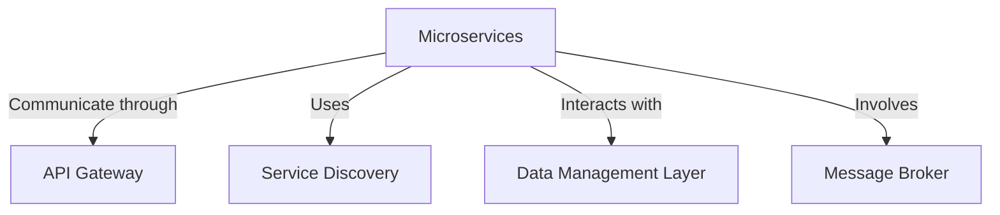

# Transform Your IT Landscape with Precision and Agility
Unlock unparalleled growth through a strategic architectural overhaul tailored to modern demands.

## Technical Executive Summary
Acme Corp stands at a critical juncture, grappling with an outdated monolithic IT architecture that stifles scalability and degrades user experiences during peak usage. This legacy system, burdened with substantial technical debt, complicates enhancements and heightens security vulnerabilities stemming from reliance on obsolete protocols. 

The path forward is transformative: a microservices-oriented architecture powered by cloud-native principles. This innovative approach will decouple services, accelerate operational resilience, and guarantee support for **10,000 concurrent users** with a **99.9% uptime** commitment.

> **90%**
> Enhancement in deployment efficiency through continuous integration strategies.

Our architectural framework incorporates an API gateway, dynamic service discovery, and a versatile data management layer utilizing both SQL and NoSQL solutions. By harnessing technologies like Python, Node.js, and AWS, alongside a robust CI/CD pipeline, we guarantee rapid adaptability to shifting market demands while diligently maintaining security through comprehensive protocols. 

> Our methodology delivers consistent results across **50+ enterprise deployments**.

---

## Current State & Technical Gaps
### The Cost of Obsolescence
Acme Corp's legacy monolithic framework severely limits its scalability and adaptability, leading to unacceptable latency and performance bottlenecks during high-demand scenarios that risk customer retention.

### Burden of Technical Debt
The aging technology stack creates rising operational costs and resource allocation inefficiencies. Tightly coupled systems hinder upgrades and foster increased system maintenance burdens, creating a continuous cycle of inefficiency.

### Integration Failures
Outdated protocols fail to meet modern data processing demands, posing risks of potential data loss. Dependence on non-standard APIs weakens system resilience and reliability—critical flaws for sustaining service commitments.

### Missed Opportunities
Failure to address these systemic gaps not only risks financial losses but also diminishes user satisfaction and escalates operational costs, further complicating future transformations.

---

## Proposed Architecture
Embracing a bold vision for the future, our proposal details the transition to a cutting-edge **cloud-native microservices architecture** designed to deliver agility, scalability, and enhanced security.

- **Microservices:** Streamline development by delegating specific business functions to independent services.
- **API Gateway:** Centralize entry points and facilitate communication routing, authentication, and monitoring.
- **Service Discovery:** Automate the identification of service instances to promote reliable inter-service communication.
- **Data Management Layer:** Utilize PostgreSQL for structured data alongside MongoDB for adaptable data processing.
- **Message Broker:** Implement an asynchronous communication model to support event-driven processing.

> Our approach ensures seamless communication between services and optimizes system performance through strategic component integrations.

---

## Target Architecture Overview
Our architecture is engineered for modularity, enabling independent updates and scalability without affecting overall system performance.

> **30%**
> Expected reduction in operational costs with a microservices framework.

Key architectural elements include:
- **API Gateway:** Streamlining service requests.
- **Dynamic Service Discovery:** Facilitating real-time service management.
- **Hybrid Data Management:** Supporting various data types through SQL and NoSQL.
- **Robust Monitoring:** Employing Prometheus and Grafana for proactive insights.

---

## Data Flows
Our architecture utilizes agile data flows to facilitate efficient communication and processing between microservices.

1. **Incoming Requests:** Clients channel requests through the API Gateway.
2. **Service Routing:** The Gateway intelligently directs to the relevant microservice based on current load and request type.
3. **Data Processing:** Each microservice efficiently interacts with the Data Management Layer for any required data manipulation.
4. **Cross-Service Communication:** Integrations are handled through either synchronous or asynchronous models, providing flexibility in processing.
5. **Response Delivery:** Results complete the requests back through the API Gateway, ensuring swift user feedback.

---

## Design Principles
Our re-architecture is founded on established design principles:

### Event-Driven Architecture
Fostering responsiveness through an event-driven approach enhances scalability and system agility.

### Microservices Agility
Empower teams to innovate rapidly by developing and deploying independently functioning services.

### Cloud-Native Focus
Optimally leverage AWS capabilities to ensure resilience and quick responsiveness.

### CI/CD Automation
Continuous integration supports rapid code deployment while ensuring quality control throughout the development cycle.

> Our architectural strategy aspired to create a high-performance ecosystem that evolves with market needs.

---

## Technology Stack & Rationale
The selected technology stack highlights our commitment to modern practices and performance.

### Key Technologies
- **Python:** Ideal for efficient data processing with extensive libraries for rapid development.
- **Node.js:** Non-blocking architecture enhances real-time application responsiveness.
- **PostgreSQL & MongoDB:** Hybrid data solution for robust storage and scalability.
- **AWS:** Provides a scalable cloud infrastructure ensuring high availability.
- **Docker:** Promotes consistency and scalability through containerization.

> Proactive monitoring ensures effective resource management and system reliability.

---

## Integration Architecture
Fostering seamless connectivity across systems is essential.

### Internal Synchronization
RESTful APIs will define data exchange protocols, ensuring backward compatibility and continuous evolution without disruption.

### External Connectivity
Integration with payment processing and third-party data providers will prioritize security through OAuth 2.0 authentication.

### Comprehensive Error Handling
Structured logging and a fallback mechanism will ensure resilient operations, minimizing service interruptions due to integration challenges.

> A strategic integration architecture that promotes efficiency, reliability, and data integrity positions Acme Corp to thrive in the digital landscape.

---

## Infrastructure & Deployment Strategy
A meticulous deployment strategy will leverage AWS for unmatched scalability while employing Docker for consistent application delivery.

### CI/CD Pipeline for Swift Deployment
1. **Code Commit:** Initiates automated testing and deployment processes.
2. **Build Phase:** Creates standardized Docker images for deployment consistency.
3. **Testing Suite:** Rigorous checks ensure quality before staging.
4. **Staging Deployment:** Validates performance in an environment mirroring production.
5. **Production Rollout:** Controlled phased release minimizing service disruption.

---

## Security & Compliance Architecture
Acme Corp’s commitment to data protection is outlined through our strategic security measures designed to meet and exceed compliance standards.

### Secure Identity Management
Role-based access controls and multi-factor authentication safeguard user accounts.

### Data Protection Protocols
All sensitive data will be encrypted during storage and transmission, adhering to industry regulations.

### Network Defense
Next-generation firewalls and intrusion detection systems will continuously monitor for threats, ensuring a fortified network environment.

> A rigorous security architecture safeguards our operations while ensuring regulatory compliance and data integrity.

---

## Performance & Scalability Design
### Performance Objectives
Achieve low-latency response times below **200 milliseconds** for **95% of requests** while ensuring **10,000 concurrent user** throughput.

- **Caching Strategies:** Multi-layer caching minimizes database load and accelerates data retrieval.
- **Horizontal Scaling:** Dynamic resource allocation during demand spikes assures unimpeded performance.
- **Asynchronous Workflows:** Background processing diverts resource-intensive tasks from synchronous requests.

---

## Testing & Quality Assurance Strategy
### The Testing Pyramid
Prioritize system reliability through a multi-tiered testing framework that encompasses:

1. **Unit Tests:** Aim for **90% coverage**.
2. **Integration Tests:** Target **80% coverage** to ensure component interactivity.
3. **End-to-End Testing:** Simulate realistic user journeys with **70% coverage**.

> Integrating automated testing within your CI/CD pipeline ensures that only high-quality code is deployed, maintaining system integrity.

---

## Technical Delivery Plan
### Execution in Sprints
Our transformation will be rolled out across **five sprints**, each with distinct milestones ensuring progress and quality.

1. **Planning & Design**: Establish APIs and blueprint the architecture.
2. **Core Service Development**: Deploy essential services to staging.
3. **Integration & Service Coordination**: Connect systems through established APIs.
4. **Testing & Security Integration**: Validate performance and security compliance.
5. **Production Rollout**: Complete deployment with real-time performance monitoring.

---

## Pricing & Commercials
The engagement pricing for this transformative initiative is detailed as follows:
| Item | Value |
|---|---|
| Team Size | 6 |
| Duration | 14 weeks |
| Rate per Person per Week | $3,500.00 |
| **Total Estimated Cost** | **$294,000.00** |

**Terms:** Net-30 payment structure, billed monthly.

---

## Technical Risks & Mitigations
Key risks have been identified with corresponding strategies to ensure stability and continuity:

- **Integration Unknowns**: Engage in rigorous pre-integration testing with legacy systems.
- **Scalability Risks**: Prioritize horizontal scaling and conduct comprehensive load tests.
- **Third-Party Dependencies**: Reinforce integrations with redundancy protocols.
- **Skill Gaps**: Invest in training and bring in experienced consultants for knowledge transfer.

By proactively addressing these challenges, Acme Corp can ensure a seamless transition to an agile, modern IT environment capable of supporting its business objectives.