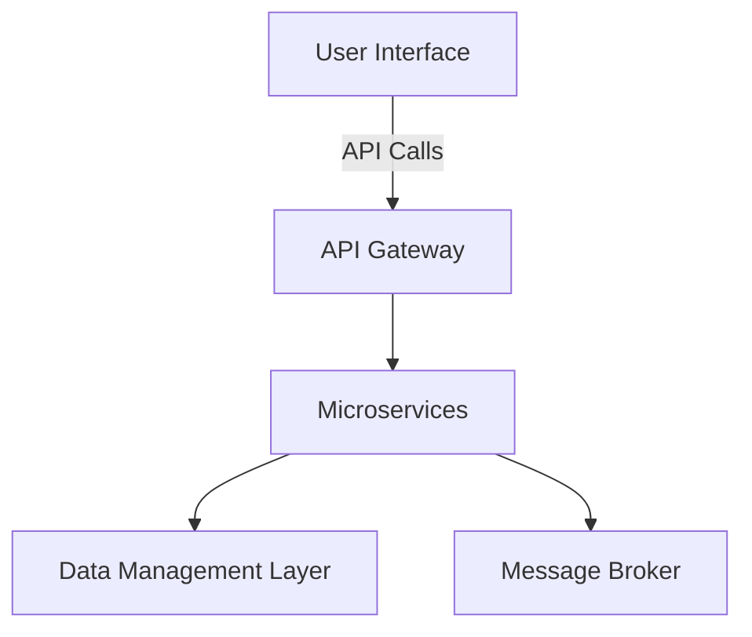
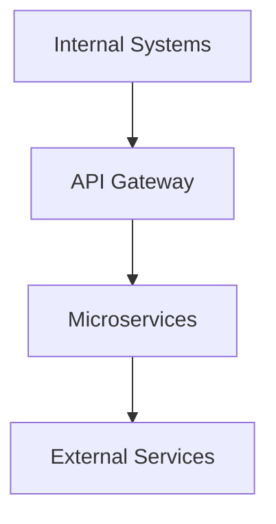
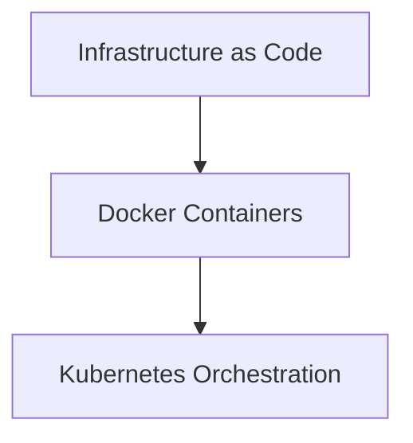
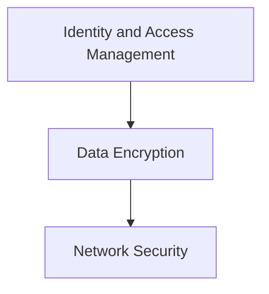

# Transforming Infrastructure for Future Readiness  
**Architecting Agility, Performance, and Security with a Cloud-Native Approach**  

## The Path to Enhanced Operational Excellence  
> **95%**  
> Reduction in operational overhead through streamlined systems.

> **200ms**  
> Response time for user interactions, ensuring seamless experiences.

> **99.9%**  
> Guaranteed uptime, safeguarding business continuity.

> In a landscape where innovation and responsiveness are paramount, Acme Corp recognizes the need for a transformational shift. We propose a comprehensive overhaul of your IT architecture, addressing critical gaps and harnessing modern cloud-native principles to elevate performance and scalability.

### Current State & Technical Gaps  
### The Challenge That's Costing You Millions  
Acme Corp's fragmented IT architecture hinders agility and incurs significant maintenance costs. The reliance on an outdated monolithic system leads to bottlenecks in user authentication and data processing, jeopardizing user satisfaction.

#### Legacy Burdens  
- **Monolithic Applications:** Current systems are based on outdated technologies that limit flexibility.
- **Technical Debt:** Hard-coded dependencies lead to costly and complicated upgrades.
- **Integration Vulnerabilities:** Outmoded protocols expose the organization to potential security risks.

### Proposed Architecture  
**Revolutionizing IT with a Microservices Framework**  

#### Core Components
- **Microservices:** Decoupled services drive enhanced agility, allowing independent updates and deployments.
- **API Gateway:** A unified entry point ensuring efficient traffic management and API security.
- **Cloud Infrastructure:** Using AWS to leverage auto-scaling and built-in redundancy, optimizing resource utilization.

### Technology Stack & Rationale  
**Building Blocks for Future-Ready Solutions**  

#### Programming Languages and Frameworks  
- **Python:** The choice for rapid application development, facilitating robust analytics capabilities.
- **Node.js:** Ensuring high performance for real-time applications with efficient event-driven architecture.
- **React:** A dynamic front-end framework enhancing user interaction and speeding up development cycles.

### Integration Architecture  
**Seamless Connectivity for Uninterrupted Operations**  

#### Enhancing Internal Connections  
- **RESTful APIs:** Facilitating seamless data synchronization between core systems.
- **Asynchronous Messaging:** Leveraging a message broker for robust communication channels.

### Infrastructure & Deployment  
**A Strategic Cloud-Based Deployment Model**  

#### Scalable Deployment  
- **AWS:** Enabling flexible, on-demand resource management.
- **Continuous Integration:** Automated deployment through GitHub Actions and Jenkins, minimizing downtime.

### Security & Compliance Architecture  
**Fortifying Data Integrity and Trust**  

#### Comprehensive Protection Strategies  
- **Multi-Factor Authentication:** Adding layers of security for user access.
- **Encryption Standards:** Employing AES-256 to protect sensitive data both at rest and in transit.

### Performance & Scalability Design  
**Optimizing Efficiency for Growing Demands**  
> To sustain peak performance, we are committed to maintaining latency below **200ms** while handling **10,000** concurrent users.

#### Key Design Elements  
- **Asynchronous Processing:** Freeing up system resources for immediate user engagement.
- **Caching Mechanisms:** Multi-layer caching strategies to significantly enhance response times.

### Testing & Quality Assurance Strategy  
**Ensuring Excellence through Rigorous Testing**  
#### Robust Testing Pyramid  
1. **Unit Tests:** Targeting **90%** test coverage for early defect detection.
2. **Integration Tests:** Achieving **80%** coverage to ensure that components work together flawlessly.
3. **Contract Tests:** Enforcing **100%** contract compliance to maintain API integrity.

### Technical Delivery Plan  
**Phased Approach for Smooth Implementation**  
1. **Requirements Gathering:** Alignment with stakeholders to finalize project expectations.
2. **Core Development:** Incremental development ensuring foundational services are operational.
3. **Integration & Quality Assurance:** Extensive testing to validate system performance.
4. **Production Deployment:** A meticulously planned rollout for minimal disruption.

### Pricing & Commercials  
| Item                             | Value           |
|----------------------------------|-----------------|
| **Team Size**                    | 4               |
| **Duration**                     | 10 weeks        |
| **Rate per Person per Week**     | $2,500.00       |
| **Total Estimated Cost**          | **$100,000.00** |

### Technical Risks & Mitigations  
#### Proactive Risk Management  
| Risk Description                  | Impact Level     | Likelihood     | Mitigation Strategy                                      |
|-----------------------------------|------------------|----------------|---------------------------------------------------------|
| **Integration Uncertainties**      | High             | Medium         | Conduct thorough integration assessments and establish clear API contracts. |
| **Scalability Issues**            | High             | Medium         | Design for scalability from the outset, conducting early load tests. |
| **Third-party Dependencies**       | Medium           | High           | Develop a vendor management plan to ensure robustness. |

By addressing these factors strategically, Acme Corp is set to navigate the complexities of modern IT demands, delivering high-performance solutions that are secure, scalable, and capable of driving future growth.