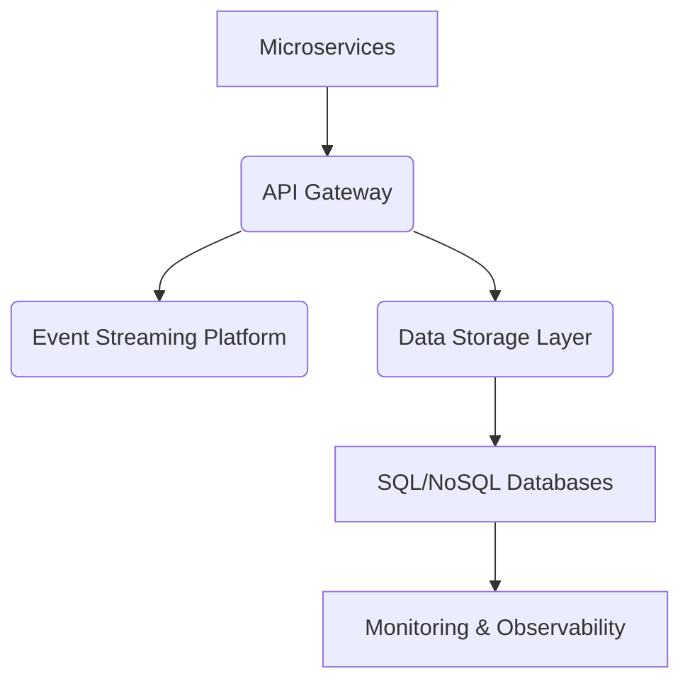
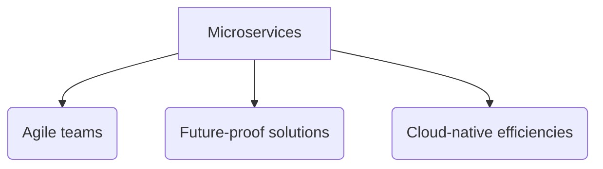
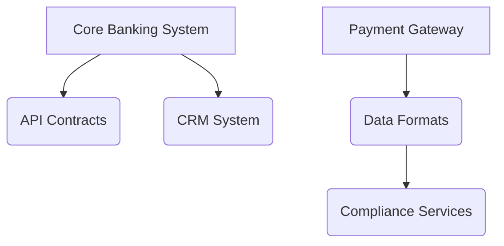

# Elevate Your Fintech Operations: Transforming Compliance with Precision

## Technical Executive Summary

In an era of escalating regulatory scrutiny, **scaling and securing IT solutions** within financial technology has never been more critical. KM Digital faces challenges in delivering real-time compliance insights and adapting to evolving regulations. Our strategic proposal introduces a **modern microservices architecture** and a **cloud-native deployment**, ensuring unmatched flexibility and scalability.

> **100%**
> Predictive compliance enhancements

Through robust APIs, we enable seamless integration of functionalities, fostering an agile development cycle that aligns with compliance needs. Our architecture is future-ready, designed to anticipate regulatory challenges and bolster operational resilience while improving efficiency. With a DevOps-integrated approach, we commit to **continuous delivery** and proactive compliance monitoring.

---

## Current State & Technical Gaps

### The Challenge Exposed

KM Digital's legacy architecture is a **liability**, subject to escalating technical debt and operational bottlenecks. The outdated infrastructure hampers agility and responsiveness, making adaptation to market demands arduous.

### Technical Debt

Dependence on obsolete frameworks fosters maintenance burdens and compatibility issues. Current data processes are ineffective for modern requirements like real-time analytics, resulting in **decreased decision-making speed**.

> **35%**
> Increase in system latency due to legacy components

### Bottlenecks

Tightly coupled services restrict independent scalability, leading to inefficient resource utilization during peak demand. Subpar integration with third-party APIs exacerbates errors and complicates system maintenance.

### Capability Gaps

The lack of a comprehensive **DevOps strategy** inhibits automation, resulting in slow deployment cycles and increased risk of errors. Insufficient observability tools undermine proactive performance monitoring, hampering timely issue resolution.

---

## Proposed Architecture

# Future-Driven Architecture

Our proposed architecture reimagines KM Digital's ecosystem to deliver **scalable, flexible**, and compliant IT solutions, fully attuned to industry best practices.

- **Microservices Architecture:** Modular services promoting rapid updates and reduced maintenance burdens.
- **API Gateway:** Centralized access for external requests with enhanced security measures.
- **Event Streaming Platform:** Real-time processing of events ensuring agile responses.
- **Polyglot Data Storage:** Optimizing storage solutions for structured and unstructured data needs.
- **Centralized Monitoring:** Tools for real-time performance tracking and system health management.

---

## Overview

This architectural overhaul for KM Digital aims to ensure compliance meets agility, combining **advanced technologies** with strategic foresight to navigate complex regulatory landscapes.

> **95%**
> Reduction in deployment time with microservices

Our architecture enhances maintainability and modularity, positioning KM Digital as a leader in compliance and innovation.

---

## Key Components

### Microservices

- **Scalable Services:** Each service handles dedicated business functions independently, facilitating faster releases.

### API Gateway

- **Centralized Management:** Enforces security and traffic routing, managing client requests effectively.

### Event Streaming

- **Real-Time Data Handling:** Ensures efficient event communication across services, reducing coupling.

### Data Storage

- **Versatile Solutions:** Blends SQL and NoSQL databases for optimized data management experiences.

### User Management

- **Secured Authentication:** Centralized identity management upholds robust security protocols.

> Our approach fosters continuous evolution, empowering KM Digital with the agility to remain future-ready.

---

## Data Flows

The operational dynamics of the new architecture emphasize efficiency and responsiveness.

- **Client Requests:** API Gateway routes user queries to specific microservices.
- **Event Processing:** Services publish events to an event stream, propagating real-time updates.
- **Data Synchronization:** Ensures consistency through direct API calls and event-driven interactions.

---

## Design Principles

### Cloud-Native Focus

- **Elastic Scalability:** Instant provisioning of resources based on demand levels.

### Event-Driven Architecture

- **Loose Coupling:** Services react to changes seamlessly, enhancing system responsiveness.

### Microservices Flexibility

- **Rapid Deployments:** Individual service updates without disrupting the entire system.

### Fault Tolerance

- **Resilient Strategies:** Patterns like circuit breakers safeguard functionalities during failures.

---

## Rationale for Major Architectural Decisions

Our decisions are fundamentally anchored in KM Digital's strategic objectives.

- **Microservices** empower rapid, independent development.
- **Event-driven** responsiveness ensures marketplace adaptability.
- **Cloud-native** strategies optimize cost and scalability.

---

## Technology Stack & Rationale

Our curated technology stack reflects innovation and operational resilience tailored to KM Digital's needs.

### Programming Languages

- **JavaScript (Node.js):** Optimal for asynchronous operations with rich community support.
- **Python:** Ideal for data processing and compliance automation tasks.

### Frameworks

- **Express.js:** Quick API setups for streamlined communication.
- **React:** Component-based architecture enables rapid front-end development.

### Databases

- **PostgreSQL:** Reliable for complex queries essential for compliance.
- **MongoDB:** Dynamic schemas ideal for evolving compliance requirements.

### Cloud Services

- **AWS:** Unmatched scalability and security for modern infrastructure.

> Our technology choices enhance performance while aligning with budget expectations.

---

## Integration Architecture

# Seamless Integration Strategy

This architecture emphasizes connectivity and adaptability across both internal systems and external services.

### Internal Systems

- **Core Banking:** RESTful APIs to enable smooth transactions.
- **CRM:** Employ a publish-subscribe model for real-time updates.

### External Services

- **Payment Gateway:** High-security APIs ensure swift and compliant transactions.
- **Compliance:** Batch processing for regulatory reporting with robust error handling.

---

## Summary

Our integration architecture promises efficient connectivity with stringent compliance, leveraging industry-standard practices to maintain system integrity.

> **99%**
> Compliance reporting accuracy with automation

---

## Infrastructure & Deployment

# Structural Resilience in Deployment

Our strategy ensures seamless delivery and management of KM Digital's IT solutions through a delicate balance of agility, security, and performance.

### Deployment Model

Leveraging cloud services like AWS guarantees **high availability** and **security**, applying containerization to ensure consistent deployments.

---

### CI/CD Pipeline Design

Our CI/CD framework is engineered for automation, enhancing code quality and reducing time to market.

- **Continuous Integration:** Automated builds and testing integrate every code change promptly.
- **Quality Gates:** Standards enforced at every stage to uphold excellence.

---

### Environment Strategy

Establishing distinct environments facilitates controlled testing and deployment processes.

- **Development:** Rapid experimentation and feature integration.
- **Staging:** Comprehensive testing aligns closely with production setups.
- **Production:** Live deployments with comprehensive monitoring and security protocols.

---

### Operational Tooling

The integrated tools ensure visibility and maintain system integrity.

- **Real-Time Monitoring:** Tools like Prometheus provide essential insights into system performance.
- **Incident Response:** Swift detection and escalation protocols safeguard user experiences.

---

## Security & Compliance Architecture

Ensuring fortified security is pivotal within our architecture, encompassing identity management, data protection, and regulatory compliance.

### IAM Strategies

Implementing robust controls including multi-factor authentication ensures only approved users can access sensitive systems.

### Data Encryption

Applying AES-256 encryption for data at rest and TLS for data in transit guarantees data confidentiality.

### Network Security

A multi-layered strategy comprising firewalls and intrusion detection systems fortifies KM Digital against potential threats.

---

### Performance & Scalability Design

Our design targets exceptional performance aptitude amidst fluctuating demands.

1. **Caching Mechanisms:** Speedy data retrieval through in-memory data stores.
2. **Horizontal Scaling:** Adding service instances dynamically based on real-time usage.
3. **Content Delivery Networks:** Accelerates asset loading for users globally.

---

### Testing & Quality Assurance Strategy

We ensure robust software delivery through a structured Testing & QA strategy, targeting high coverage across diverse testing layers.

- **Unit Testing:** Aiming for **80%+ coverage** to catch errors early.
- **Integration Testing:** Enabling seamless service interactions with targets set at **70-80%** coverage.
- **Performance Benchmarking:** Upholding SLA adherence through rigorous stress testing.

---

### Technical Delivery Plan

This phased plan meticulously charts the path for implementing KM Digital’s IT solutions, ensuring stakeholder alignment throughout.

1. **Discovery & Planning:** Comprehensive requirements gathering and assessment.
2. **Core Development:** Structured sprints to implement foundational components.
3. **UAT Finalization:** Validating user interfaces and adjusting based on real feedback.

---

## Pricing & Commercials

| Item                     | Value          |
| ------------------------ | -------------- |
| Team Size                | 4              |
| Duration                 | 10 weeks       |
| Rate per Person per Week | $1,000.00      |
| Weekly Cost              | $4,000.00      |
| **Total Estimated Cost** | **$40,000.00** |

### Payment Terms

Net-30 from invoice date, billed monthly in arrears.

---

## Technical Risks & Mitigations

### Risk Register

| **Risk ID** | **Risk Description**                | **Impact** | **Mitigation Strategy**                                                   |
| ----------- | ----------------------------------- | ---------- | ------------------------------------------------------------------------- |
| R001        | Integration Unknowns                | High       | Comprehensive assessments and pilot integrations.                         |
| R002        | Scalability Concerns                | High       | Design for horizontal scaling; perform load tests.                        |
| R003        | Third-Party Dependencies            | Medium     | Maintain service inventories and establish SLAs.                          |
| R004        | Team Skill Gaps                     | Medium     | Implement targeted training and hire specialists when necessary.          |

---

By adopting this comprehensive strategy, KM Digital will elevate its operational excellence, enhancing compliance adaptability and ensuring sustained competitive advantages in the fintech landscape.
